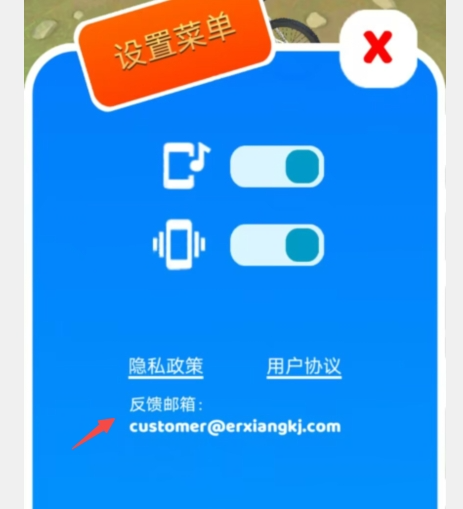
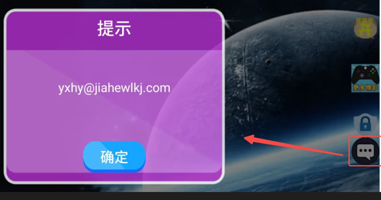
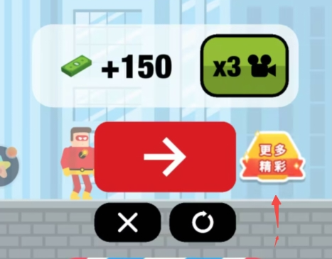

# App游戏自测

## Android

### 一、隐私政策和用户协议（必接）

在手机上点击用户协议或隐私政策后，出现如下弹框：

<figure><figcaption></figcaption></figure>

 

<figure><figcaption></figcaption></figure>

### 二、统计上报

**1、初始化事件（必接）**

| **事件名称**    | **事件ID**           | **触发时机**      | **附加参数** |
| ----------- | ------------------ | ------------- | -------- |
| 游戏loading页面 | app\_loading\_show | 游戏引擎初始化后就触发上报 | 无        |
| 游戏内首页       | app\_home\_show    | 主页展示时         | 无        |

触发事件，过滤tj-dnstatistics，有save: {事件名}即可，如下图：

<figure><figcaption></figcaption></figure>

**2、关卡事件（必接）**

触发关卡开始、关卡胜利、关卡失败，过滤tj-dnstatistics，有save: um\_plus\_game\_level即可，如下图：.png>)

### 三、广告能力（必接）

打开对应类型广告时能展示正确的广告样式即可，广告样式详情见下方截图：

<figure><figcaption>
开屏广告样式
</figcaption></figure>

 

<figure><figcaption>
激励视频广告样式
</figcaption></figure>

 

<figure><figcaption>
banner广告样式
</figcaption></figure>

 

<figure><figcaption>
普通插屏广告样式
</figcaption></figure>

 

<figure><figcaption>
嵌入式广告样式
</figcaption></figure>

信息流广告样式，出现以下类似的广告样式即可：

<figure><figcaption></figcaption></figure>

### 四、oppo、vivo反馈邮箱

oppo、vivo渠道需要在设置界面或者外接一个界面显示一个反馈邮箱（点击不用跳转）

### 五、oppo更多精彩

oppo渠道需要再游戏结算界面或者其他二级子界面展示更多精彩的按钮，点击后能正常跳转oppo超休游戏中心

## IOS

### 一、隐私政策和用户协议（必接）

在手机上点击用户协议或隐私政策后，出现如下弹框：

<figure><figcaption></figcaption></figure>

 

<figure><figcaption></figcaption></figure>

### 二、统计上报

**1、初始化事件（必接）**

| **事件名称**    | **事件ID**           | **触发时机**      | **附加参数** |
| ----------- | ------------------ | ------------- | -------- |
| 游戏loading页面 | app\_loading\_show | 游戏引擎初始化后就触发上报 | 无        |
| 游戏内首页       | app\_home\_show    | 主页展示时         | 无        |

触发事件，过滤tj-kafka，有event\_name : {事件名}即可，如下图：

<figure><figcaption></figcaption></figure>

**2、关卡事件（必接）**

触发关卡开始、关卡胜利、关卡失败，过滤tj-dnstatistics，有event\_name : um\_plus\_game\_level即可，如下图

<figure><figcaption></figcaption></figure>

### 三、广告能力（必接）

打开对应类型广告时能展示正确的广告样式即可，广告样式详情见下方截图：

<table><thead><tr><th width="188">广告样式</th><th width="185.33333333333331">截图</th></tr></thead><tbody><tr><td>banner</td><td></td></tr><tr><td>激励视频</td><td></td></tr><tr><td>插屏视频</td><td></td></tr><tr><td>插屏</td><td></td></tr><tr><td>msg</td><td></td></tr><tr><td>开屏</td><td></td></tr></tbody></table>
