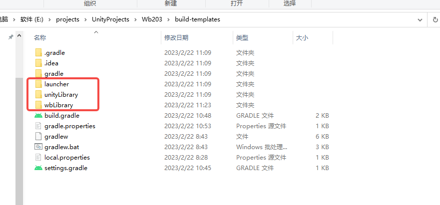

# 接入文档

## **一、SDK接入步骤**

### **开发前准备**

广告位文档、上报埋点统计文档。@运营同学

### **导入SDK插件**

* Unity游戏：将`DN_PLUGIN_UNITY.unitypackage`插件，导入到游戏unity工程。

下载链接：https://gui.vigame.cn/CP/Unity/UnityPackage/DN\_PLUGIN\_UNITY\_2.1.9\_C.unitypackage

### **Android接入**

使用模板接入，模板工程已接入sdk所需要的配置。只需将游戏unity工程Android导出，将资源和lib等文件拷贝到对应文件中即可。

下载链接：https://gui.vigame.cn/CP/Unity/build-templates/build-templates.zip

模板工程目录结构：

<figure><figcaption></figcaption></figure>

替换`unity-classes.jar`文件：

<figure><figcaption></figcaption></figure>

替换`so`文件：


注意：游戏工程导出后需编译生成`libil2cpp.so`再拷贝替换。


<figure><figcaption></figcaption></figure>

替换资源文件：

<figure><figcaption></figcaption></figure>

修改游戏icon和名称

<figure><figcaption></figcaption></figure>

修改启动页闪屏图

<figure><figcaption></figcaption></figure>

操作完上述步骤后即可运行工程，查看游戏内容。

**关于包名**

由动能打包时，自行更换正式包名。

**关于签名**

如无特殊要求，正式包会使用动能的签名文件。

### **iOS接入**

Unity直接选择File->Build Setting导出iOS工程，并将xcode工程提供给动能以进行iOS打包。

<figure><figcaption></figcaption></figure>

**iOS授权和证书**

1、需要授予我们公司appid账号（appstore@bubbleteastudios.cc）app管理权限，如下图所示

<figure><figcaption></figcaption></figure>

2、需提供发布证书的dev，dis类型的p12（包括密码），以及这两个发布证书对应的dev，dis描述文件

<figure><figcaption></figcaption></figure>

<figure><figcaption></figcaption></figure>

**接入iOS模拟测试模块**

1、clone[自动化脚本]( https://gitee.com/vigamedev/vigame.git)到工程目录

2、安装插件

```shell
gem install plist
gem install xcodeproj
```

2、执行脚本

```
sh ./vigame/auto.sh  b3e75b912e672146
```

3、出包测试


## 二、常用接口

### **日志打印**

调用该接口后会开启日志输出

```C#
/// <summary>
/// 日志打印开关
/// </summary>
/// <param name="isDebug">true是可打印日志，false否不打印日志</param>
public void SetDebug(bool isDebug)
```

### **游戏退出（必接）**

游戏退出时先判断是否支持第三方退出，支持则调用SDK接口，不支持则调用游戏本身的退出逻辑。[用例参考](https://blog.csdn.net/Czhenya/article/details/78237374)

```C#
void Update()
{
    if (Input.GetKeyDown(KeyCode.Escape))
    {
        if (Wb.PayManager.Instance.IsSupportExit())
        {
            //如果支持退出，则调用openExitGame接口
            Wb.PayManager.Instance.OpenExitGame();
        } else {
            //否则展示游戏的退出窗口
        }  
    }
}
```

### **隐私政策和用户协议（必接）**

示例

```CSS
// 隐私政策
Wb.CoreManager.Instance.OpenPrivacyPolicy();
// 用户协议
Wb.CoreManager.Instance.OpenUserAgreement();
```

### **反馈邮箱（安卓必接）**

在设置界面显示邮箱信息，获取到数据就显示，没有就不显示。 &#x20;

> 安卓：读取assets/ConfigVigame.xml中的Email字段。&#x20;
>
> &#x20;iOS：读取VigameLibrary.plist中的Email字段。

```CSS
//get email config from ConfigVigame.xml
string str = Wb.CoreManager.Instance.getConfigVigameValue("Email");
if (str.Length == 0)
{
   //not have the Email config
}
else
{
    // have the Email config show the config on Setting.

}
```

### **客服中心（选接）**

```C#
/// <summary>
/// 打开客服中心
/// </summary>
/// <param name="title">网页标题</param>
/// <param name="loginId">用户id</param>  
public void OpenClientCenter(string title, string loginId) 
```

### **更多精彩（oppo联运渠道必接）**

> 先判断是否显示更多精彩按钮结果返回true才显示

否显示更多精彩按钮

```C#
/// <summary>
/// 否显示更多精彩按钮
/// </summary>
public bool IsMoreGameBtn() 
```

打开更多精彩

```C#
/// <summary>
/// 打开更多精彩
/// </summary>
public void OpenMoreGame() 
```

示例

```C#
//否显示更多精彩按钮
Wb.PayManager.Instance.IsMoreGameBtn();
//打开更多精彩
Wb.PayManager.Instance.OpenMoreGame();
```

按钮资源

<figure><figcaption></figcaption></figure>

### **统计上报**

列举的接口根据游戏实际情况使用，事件id参数使用上报文档中的参数填写。游戏自定义事件通过自定义上报接口进行上报。

#### **自定义事件（选接）**

**单独事件**

```C#
/// <summary>
/// 单独事件上报
/// </summary>
/// <param name="eventId">事件id，可根据统计文档填写</param>
public void TJCustomEvent(string eventId)
```

**app\_loading\_show和app\_home\_show推荐接入，以便于分析启动漏斗转化。**

| **事件名称**    | **事件ID**           | **触发时机**      | **附加参数** |
| ----------- | ------------------ | ------------- | -------- |
| 游戏loading页面 | app\_loading\_show | 游戏引擎初始化后就触发上报 | 无        |
| 游戏内首页       | app\_home\_show    | 主页展示时         | 无        |

示例

```C#
//进入冷启动Loading页面时
Wb.TjManager.Instance.TJCustomEvent("app_loading_show");
//进入游戏首页时
Wb.TjManager.Instance.TJCustomEvent("app_home_show");
```

**携带标签上报**

```C#
/// <summary>
/// 上报
/// </summary>
/// <param name="eventId">事件id，可根据统计文档填写</param>
/// <param name="label">label内容</param>
public void TJCustomEvent(string eventId, string label)
```

示例

```C#
Wb.TjManager.Instance.TJCustomEvent("事件id"，"label内容");
```

**多属性上报**

```C#
/// <summary>
/// 多属性上报
/// </summary>
/// <param name="eventId">事件id，可根据统计文档填写</param>
/// <param name="attributes">attributes</param>
public void TJCustomEvent(string eventId, Dictionary<string, string> attributes)
```

示例

```C#
//关卡触发的自定义事件
Dictionary<string, string> ps = new Dictionary<string, string>();
ps["level"] = level.ToString();
ps["skinID"] = skinID.ToString();
ps["boost"] = boost ? "1" : "0";
Wb.TjManager.Instance.TJCustomEvent("事件id", ps);

//视频广告奖励按钮显示时，检查广告是否已准备好。如没有准备好，则需要隐藏视频按钮；如果准备好，则显示按钮，并调用此方法统计。
Dictionary<string, string> ps = new Dictionary<string, string>();
ps["ad_pos"] = adName;
Wb.TjManager.Instance.TJCustomEvent("ad_video_ready", ps);
```

#### **关卡开始（必接）**

```C#
/// <summary>
/// 关卡开始
/// </summary>
/// <param name="level">关卡id</param>
public void StartLevel(string level)
```

示例

```C#
Wb.TjManager.Instance.StartLevel("1");
```

#### **关卡获胜（必接）**

```C#
/// <summary>
/// 关卡获胜
/// </summary>
/// <param name="level">关卡id</param>
/// <param name="score">得分</param>
public void FinishLevel(string level, string score)
```

示例

```C#
Wb.TjManager.Instance.FinishLevel("1", "100");
```

#### **关卡失败（必接）**

```C#
/// <summary>
/// 关卡失败
/// </summary>
/// <param name="level">关卡id</param>
/// <param name="score">得分</param>
public void FailLevel(string level, string score)
```

示例

```C#
Wb.TjManager.Instance.FailLevel("1", "10");
```

### **广告能力（必接）**

根据广告位文档填写广告位的参数。

#### **广告是否准备好（选接）**

```C#
/// <summary>
/// 广告是否准备好
/// </summary>
/// <param name="adName">广告位</param>
public bool IsAdReady(string adName)
```

#### **关卡是否可以打开该广告（选接）**

```C#
/// <summary>
/// 关卡是否可以打开该广告
/// </summary>
/// <param name="adName">广告位</param>
/// <param name="level">关卡</param>
public bool IsAdBeOpenInLevel(string adName, int level)
```

#### **获取原生广告参数（选接）**

```C#
/// <summary>
/// 获取广告参数
/// </summary>
/// <param name="adName">广告位</param>
/// <returns></returns>
public string GetNativeData(string adName)
```

#### **打开嵌入式广告（选接）**

```C#
/// <summary>
/// 打开嵌入式广告
/// </summary>
/// <param name="adName">广告位</param>
/// <param name="showRect">展示区域</param>
/// <param name="clickRect">点击区域数组</param>
/// <param name="callBackFun1">关闭广告回调</param>
/// <param name="callBackFun2">打开成功失败回调</param>
public void ShowMsgAD(string adName, RectTransform showRect, RectTransform[] clickRect, ADCallback callBackFun1 = null, ADCallback callBackFun2 = null)
```

#### **打开广告（必接）**

```C#
/// <summary>
/// 打开广告
/// </summary>
/// <param name="adName">广告位名称</param>
/// <param name="callBackFun">广告关闭回调</param>
/// <param name="adStartFun">广告播放状态回调(可不设置回调)</param>
public void OpenAd(string adName, ADCallback callBackFun = null, AdStartCallback adStartFun = null)
```

#### **打开信息流广告（选接）**

```C#
/// <summary>
/// 打开信息流广告
/// </summary>
/// <param name="rect">广告展示区域，锚点为中心</param>
/// <param name="adName">广告位</param>
public void OpenYsAd(RectTransform rect, string adName = "yuans")
```

示例

```C#
    //打开视频广告
    public void OpenVideo() 
    {
        Wb.ADManager.Instance.OpenAd("home_mfzs", (result, resultParam) =>
        {
            if (result == Wb.ADResult.NotReady)
            {
                Debug.Log("广告未准备好~");
            }
            else if (result == Wb.ADResult.Success)
            {
                Debug.Log(resultParam.ToString());
                Debug.Log("广告打开成功~");
            }
            else
            {
                Debug.Log(resultParam.ToString());
                Debug.Log("广告打开失败~");
            }
        });
    }
    
    //打开插屏广告
    public void OpenPlaque() 
    {
        Wb.ADManager.Instance.OpenAd("pause", (result, resultParam) =>
        {
            if (result == Wb.ADResult.NotReady)
            {
                Debug.Log("广告未准备好~");
            }
            else if (result == Wb.ADResult.Success)
            {
                Debug.Log(resultParam.ToString());
                Debug.Log("广告打开成功~");
            }
            else
            {
                Debug.Log(resultParam.ToString());
                Debug.Log("广告打开失败~");
            }
        });
    }
    
    //打开banner广告
    public void OpenBanner() 
    {
        Wb.ADManager.Instance.OpenAd("banner");
    }
```

\


### **签名验证 （防止盗版包必接）**

游戏开始时，需要签名验证，调用该方法验签，只有动能认可的签名信息才能通过验证。

```C#
/// <summary>
/// 签名验证
/// </summary>
/// <param name="successCall">成功回调</param>
/// <param name="failCall">失败回调</param>
public void CheckSignature(UnityAction successCall, UnityAction failCall)
```

示例

```C#
Wb.CoreManager.Instance.CheckSignature(delegate ()
{
   //验签成功，正常进入游戏
},

delegate ()
{
   //验签失败，直接闪退等
});
```

自测

```C#
过滤日志CheckSign查看验签结果
可以使用其他签名文件签名，签名apk运行后是否启动闪退。
```


